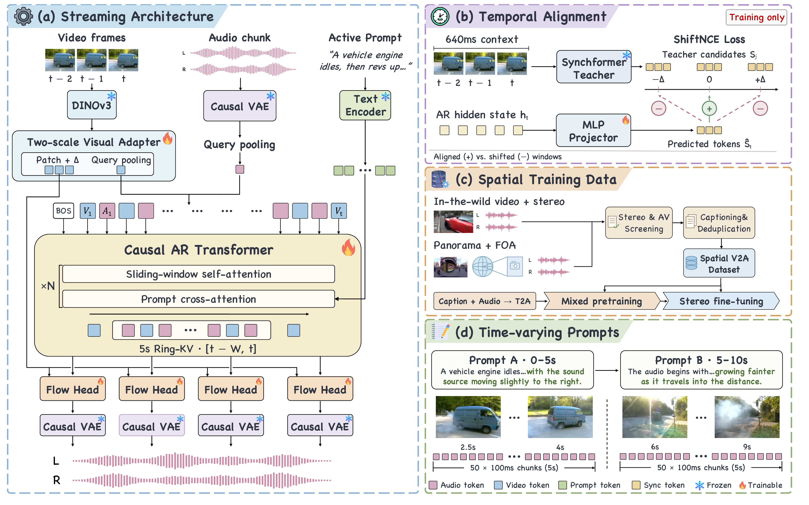

# WorldSonus: Bringing Sound to Worlds

[](https://arxiv.org/abs/2610.08760)
[](https://noizai.github.io/WorldSonus/)
[](https://huggingface.co/FF2416/WorldSonus)
[](LICENSE)

**WorldSonus brings synchronized, controllable stereo sound to visual worlds.**
Our causal autoregressive diffusion model generates audio in 100 ms chunks,
combining fine-grained visual motion with text instructions that can change
during a sequence.

## Demo

https://github.com/user-attachments/assets/22400b47-b292-476a-89a1-eeaf33372ba2

## Overview



## Installation

Requires Python 3.10+, a CUDA-capable GPU, FFmpeg and ffprobe. The setup script
installs PyTorch with CUDA 12.4 wheels; GPU drivers must already be installed.

```bash
git clone https://github.com/NoizAI/WorldSonus.git
cd WorldSonus
bash scripts/setup.sh .venv
source .venv/bin/activate
pip install -e '.[features]'
```

## Pretrained models

Weights are available on [Hugging Face](https://huggingface.co/FF2416/WorldSonus).
The latest 150k model uses a four-second context window, read automatically from
the checkpoint. Update the code and rerun the download command when upgrading.
The earlier `worldsonus_150k.pt` remains compatible through `--checkpoint`;
it retains its original five-second window.

Download the generation model, audio decoder, normalization statistics, and
frozen video/text encoders:

```bash
python scripts/download_model.py --output assets
python scripts/download_encoders.py --output assets
```

DINOv3 and T5Gemma 2 retain their upstream licenses and access conditions.
Accept their terms and authenticate with Hugging Face if required. Use the
normalization statistics supplied with the checkpoint.

## Video-to-audio generation

Pass a video and an audio description directly. Feature extraction, audio
generation, and decoding run automatically:

```bash
python -m worldsonus.infer \
  --video input.mp4 \
  --prompt "Water splashes as someone runs through a shallow river. No speech." \
  --output output.wav
```

The output is stereo 48 kHz floating-point WAV, preserving decoder amplitudes
without integer-PCM clipping. By default the input duration is rounded down
to a complete 100 ms chunk. Use `--start 5 --seconds 10` to select a window, or
omit `--prompt` for video-only conditioning.

## Streaming generation

Add `--stream` to read video incrementally and generate/decode each 100 ms audio
chunk as soon as its three video frames are available:

```bash
python -m worldsonus.infer \
  --video input.mp4 --prompt "A train passes beside a river." \
  --stream --output output.wav
```

Visual temporal differences, autoregressive Ring-KV history, and causal decoder
convolution states persist across chunks. Audio is not assembled from
independently decoded clips. Model/encoder loading happens before streaming
starts; this reference implementation does not promise a particular latency.

Offline and streaming modes use the same three-frame generation path. With the
same inputs, seed, device and compilation mode, they produce matching latents;
whole-clip and incremental decoding differ only by floating-point rounding.

CUDA inference is compiled by default in both modes. Add `--no-compile` to
disable compilation; CPU inference remains uncompiled by default.
The first invocation compiles kernels, and the first chunks of a new session
warm CUDA graphs. Expect slower startup; compilation does not change the model
or sampling configuration.

For immediate playback with FFplay, stream raw PCM instead of waiting for a file:

```bash
python -m worldsonus.infer \
  --video input.mp4 --prompt "A train passes beside a river." \
  --stream --pcm-stdout \
  | ffplay -f f32le -ar 48000 -ac 2 -i - -nodisp -autoexit
```

## License

WorldSonus's original contributions are released under [CC BY-NC 4.0](LICENSE),
for non-commercial use with attribution. Third-party components retain their
own licenses; see [Third-party notices](THIRD_PARTY_NOTICES.md).

## Acknowledgments

We thank [DINOv3](https://github.com/facebookresearch/dinov3),
[T5Gemma](https://huggingface.co/google/t5gemma-2-270m-270m), and
[stable-audio-tools](https://github.com/Stability-AI/stable-audio-tools)
for their open research and tools.
